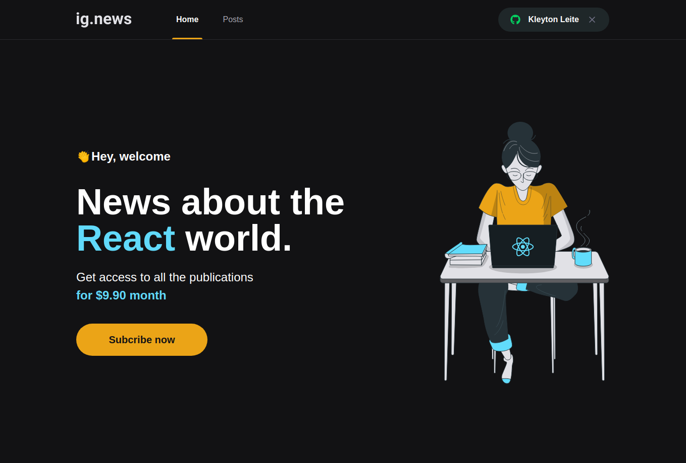

# Ignews




## 📝 Description

**Ignews** Project developed on Rocketseat's ignite journey, where we created a web blog application with content for dev's using NextJS.

---

## 💻 Used Technologies

This project has been developed using the following technologies:

- NextJs
- React
- Typescript
- Axios
- Sass
---

## 💻 Had Skill

skills developed in the project:

- JAMStack
- Next  
  - Server Side Render(SSR)
  - Static Site Generation(SSG)
- Third party api
  - Stripe
  - GitHub
- Database
  - FaunaDB
- Authentication
  - Next/auth
- Components
- Props
- Immutability
- Hook's
  - useEffect
---

## 📁 Download

```bash

# Clone the repository
$ https://github.com/KleytonLeite/next-ignews.git

# Enter into the directory
$ cd next-ignews

# Install dependencies
$ yarn

# Start the server
$ yarn dev

```

---

Made with 💙 by Kleyton Leite 👋🏻 [Get in touch!](https://www.linkedin.com/in/kleyton-leite-a384a76b/)